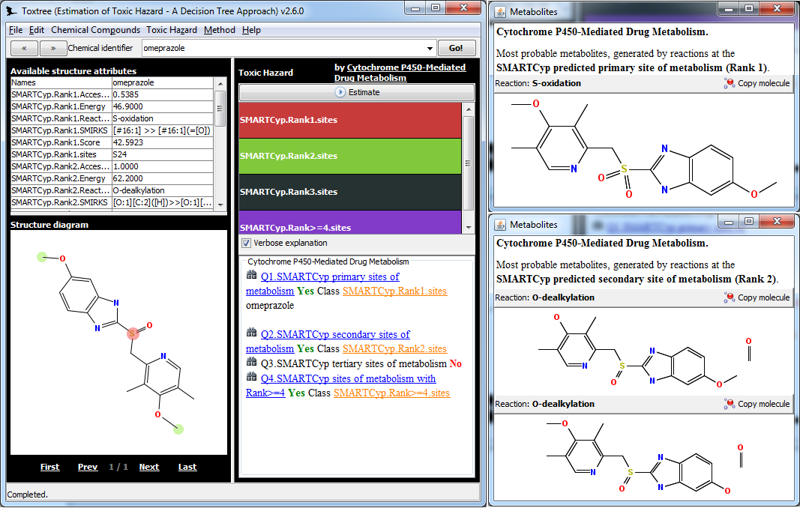

#Ambit-SMIRKS

Ambit-SMIRKS is an extension of the [Ambit-SMARTS](http://onlinelibrary.wiley.com/doi/10.1002/minf.201100028/abstract) Java library, both part of the [AMBIT project](http://ambit.sf.net)

The SMIRKS module is used to enable metabolite predictions in [Toxtree](http://toxtree.sourceforge.net),
once that site of metabolisms are predicted by [SMARTCyp](http://www.farma.ku.dk/smartcyp/)
 

##Main functionality

(1) Parsing of [SMIRKS linear notations](http://www.daylight.com/dayhtml_tutorials/languages/smirks/) into internal reaction (transformation) representations based on [The Chemistry Development Kit](http://cdk.sf.net) objects 

(2) Application of the stored reactions against target molecules for actual transformation of the target chemical objects 

### Transformation mapping modes

The transformations can be applied on various sites of the target molecule in several modes: 
(1) single 

(2) non-overlapping, 

(3) non-identical, 

(4) non-homomorphic or

(5) externally specified list of sites

### Test online at http://tinyurl.com/testreaction

### Maven artifacts

#### Depends on [The CDK](http://cdk.sf.net) 1.4.11 

    <dependency>
      <groupId>ambit</groupId>
      <artifactId>ambit2-smarts</artifactId>
      <version>2.5.1</version>
    </dependency>
    <repository>
        <id>ambit-plovdiv-releases</id>
        <url>http://ambit.uni-plovdiv.bg:8083/nexus/content/repositories/releases</url>
    </repository> 

#### Depends on [The CDK](http://cdk.sf.net) 1.5.3 

    <dependency>
      <groupId>ambit</groupId>
      <artifactId>ambit2-smarts</artifactId>
      <version>2.6.0-SNAPSHOT</version>
    </dependency>
    <repository>
        <id>ambit-plovdiv-snapshots</id>
        <url>http://ambit.uni-plovdiv.bg:8083/nexus/content/repositories/snapshots</url>
    </repository>

### Code examples

 http://ambit.sourceforge.net/AMBIT2-LIBS/ambit2-smarts/examples.html#SMIRKS

##Ambit- SMIRKS Application in metabolite generation

[Toxtree](http://toxtree.sf.net) is an open-source application that predicts various kinds of toxic effects, mostly by applying structural alerts, arranged in a decision tree fashion.

[SMARTCyp](http://www.farma.ku.dk/smartcyp/) (Cytochrome P450-Mediated Drug Metabolism) model is developed by Patrik Rydberg et al and is included as [Toxtree module](http://toxtree.sourceforge.net/smartcyp.html) since Toxtree 2.1.0. 

'

